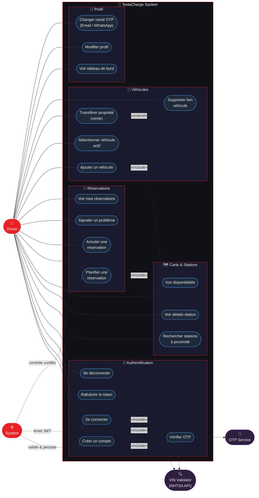
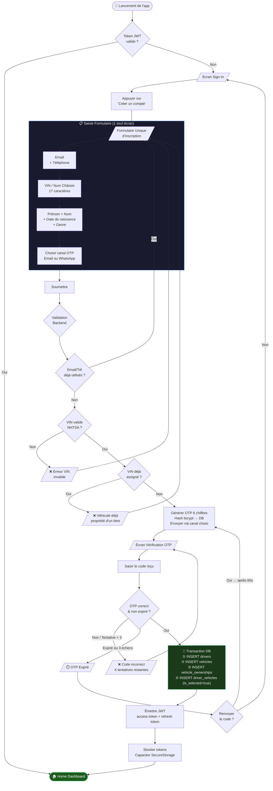
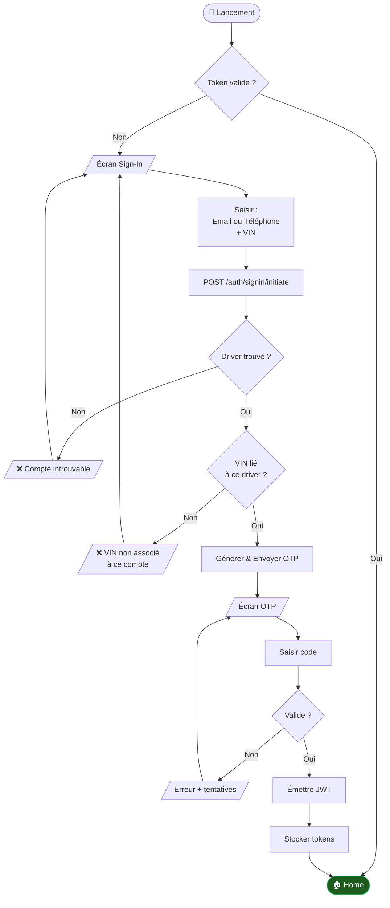
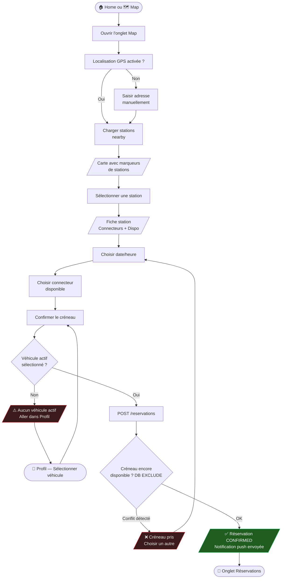
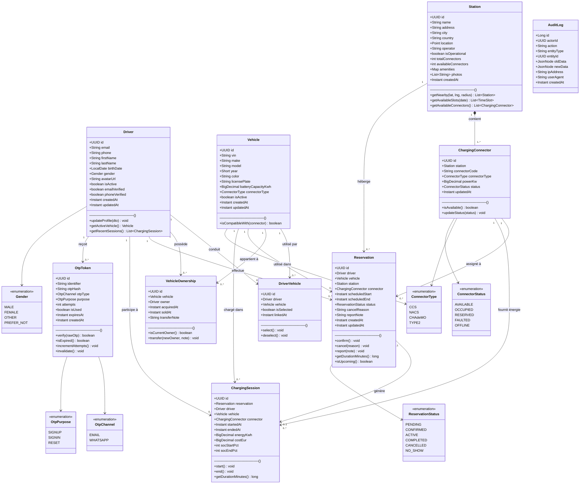

# TeslaCharge — UML Diagrams
**Application:** Mobile EV Charging Station Reservation  
**Stack:** Angular + Ionic · Spring Boot · Supabase (PostgreSQL)

---

## 1. Diagramme de Cas d'Utilisation (Use Case Diagram)

---

## 2. Diagramme d'Activité (Activity Diagram)

### 2.1 Flux Principal — Inscription (Sign-Up)

### 2.2 Flux — Connexion (Sign-In)

### 2.3 Flux — Planification d'une Réservation

---

## 3. Diagramme de Classes (Class Diagram)

---

## Légende

| Symbole | Signification |
|---|---|
| `1 --> 0..*` | Association directionnelle (un à plusieurs) |
| `1 *-- 1..*` | Composition (cycle de vie lié) |
| `0..1 --> 0..1` | Association optionnelle des deux côtés |
| `<<enumeration>>` | Type énuméré |
| `«include»` | Relation d'inclusion (cas d'utilisation) |
| `«extend»` | Relation d'extension optionnelle |

> **Note :** Les diagrammes sont écrits en syntaxe [Mermaid](https://mermaid.js.org/) et sont rendus nativement par GitHub, GitLab, Notion, VS Code (extension Mermaid) et la plupart des wikis modernes.
